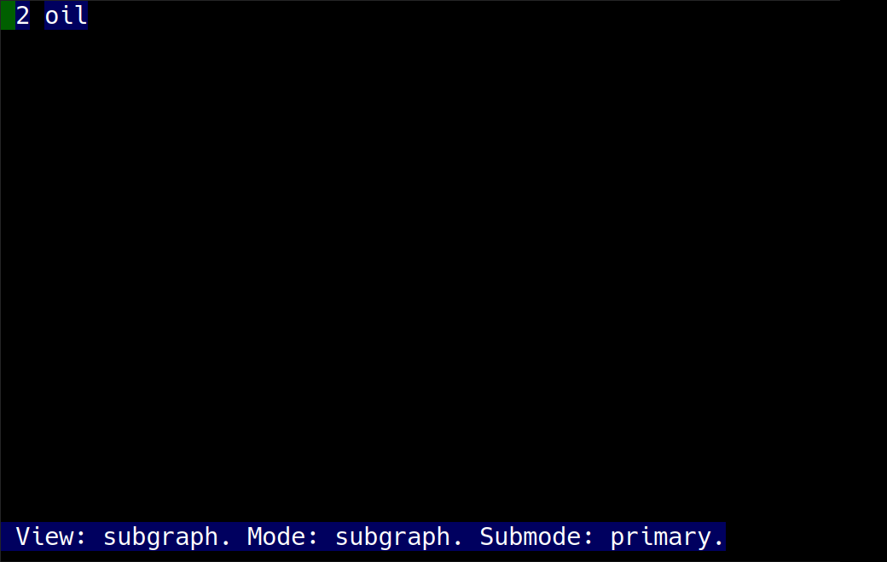
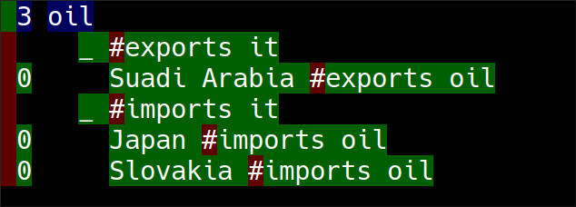
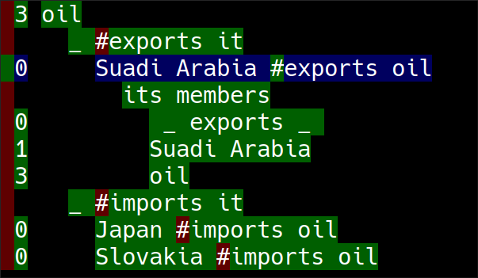

This document describes the minimal set of commands it takes to maintain a knowledge base in Hode.
They are the commands I find myself using most.


# Start it

This does not provide installation instructions;
for that, see [the README](../README.md).

Assuming you've run `stack ghci`
and it has successfully loaded the Hode libraries,
all you need to type is `ui` to start Hode.


# Add things

## Add an atomic expression, a.k.a. a "phrase"

Type `/add Ukraine`.
Type `M-x` (that probably means `Alt-x`, unless you use a Mac)
to execute the command.
You've just added the atomic expression `Ukraine` to your graph.

Phrases can have any number of words, and most special symbols.
For instance, you could add the expression
`hyperbaric syllogism for a !@#$ bleating melodrama`, with the command
`/add hyperbaric syllogism for a !@#$ bleating melodrama`.

## Add a relationship

The `#` operator is used to distinguish the joints from the members
of a relationship.

For instance, type `/add Saudi Arabia #exports oil`, then `M-x`.
You just added `Saudi Arabia`, `oil`
and an `exports` relationship between them to your graph.

## Add a relationship between relationships

Using parentheses, you can nest as many relationships as you might want.

Type `/add (Saudi Arabia #exports oil) #(because, I'm guessing) its extraction cost is 3 US dollars per barrel`, then `M-x`.
You've just added a `because, I'm guessing`
relationship between the expression `Saudi Arabia #exports oil`
(which was already present) and the new expression
`its extraction cost is 3 US dollars per barrel`.


## Add a ternary relationship

Relationships can have any positive number of members.
This command, for instance, creates one with three members:

`/add Bill #gave flowers #to Mary`


# Find things

## Find an atomic expression

Type `/find Bill`. Execute it with `M-x`.
If Bill is an expression in your graph, you now see something like this:


## Find a relationship

Same idea. For instance, `/find birds #eat worms`.


# Navigate to neighbors without typing commands

So far we've been typing things into the "command window"
at the bottom of the screen.
Many operations don't require that.

Let's add a couple expressions to the graph.
(The first expression is one we already added,
but adding it again does no harm, uses no new resources.)
```
/add Suadi Arabia #exports oil
/add Japan #imports oil
/add Slovakia #imports oil
```

Next let's visit the expression `oil`, by executing `/find oil`.
Now hide the command window with `M-c`
(which, as usual, probably means `Alt-c`).
You should see something like this:



The text at the bottom indicates  that we are no longer in
"command language mode", but rather in "subgraph mode".
This makes a new set of commands available.
This document will only describe a few of them.

The 2 in the second column of characters next to `oil` indicates that it is a member of 2 relationships.

## Find host relationships with `h`

Press `h`. You should now see something like this:


In the second layer of the tree,
we see that `oil` is in two kinds of relationship:
ones in which something exports it, and ones in which something imports it.
In the third layer,
we see all relationships belonging to those two categories.

## Navigate the view-tree with `e`, `d`, `s`, and `f`

The view-tree is Hode's term for the text on the screen in the subgraph view.
When you first run a search it's flat --
in our case it was just one element, `oil` --
but subgraph mode commands like `h` can complicate that flat list,
turning it into a multi-layered tree.

The keys `e`, `d`, `s`, and `f` serve as up, down, left and right,
respectively. Try using them to move around the view tree.
Notice how the "focused" (highlighted) expression changes.

## Find member expressions with `m`

Navigate to the expression `Saudi Arabia #exports oil`.
Now press `m`. The view-tree should now look like this:


We see the three members of the relationship.
The first one, `_ exports _`, looks kind of weird.
That's called the template for the relationship.
The other two are the "ordinary" members, `Saudi Arabia` and `oil`.


# Those are the most commonly used commands.

But that's not all! [The README](../README.md)
can point you at lots of other documentation.
It covers essential functions not mentioned here,
like loading, saving and replacing data.

That other documentation also describes a simple language called Hash that lets you run complex searches -- searches like
"foods that Amy and Billy both like that Billy isn't allergic to",
or "countries of residence of the people who came to my wedding",
or "everyone within 3 layers of command from the boss".
